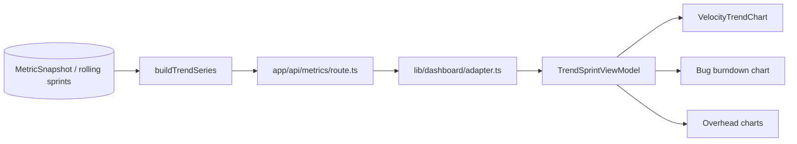

# Current Sprint Chart Visibility — Technical Specification

## Purpose

Expose the in-progress sprint in dashboard workstream trend charts. Today `buildTrendSeries` drops the selected current sprint from the rolling window; raw DB snapshots include it, but charts never receive it. This spec describes wiring the current sprint through the metrics pipeline with `mode: 'current'` and updating velocity, bug burndown, and overhead charts to label and style that sprint as in-progress.

---

## 1. Architecture Overview

### Data flow



| Layer | Responsibility | Stories / changes |
| --- | --- | --- |
| **DB / sync** | `trendSnapshots` already include all rolling sprints (including current). | No schema change for this feature. |
| **`lib/metrics/trend-service.ts`** | `buildTrendSeries` builds the sprint series used everywhere. | Append current sprint with `mode: 'current'`; extend `TrendSprintMetrics.mode`. |
| **`app/api/metrics/route.ts`** | Aggregates trend output, bug burndown, overhead; passes to client. | Ensure `computeBugBurndown` and related paths see five sprints where applicable; override placeholders as today. |
| **`lib/dashboard/types.ts` + `adapter.ts`** | API ↔ view models. | `ApiTrendSprint.mode`, `TrendSprintViewModel.isCurrent`; `mapTrendSprint` sets `isCurrent` from mode. |
| **Chart components** | Render Recharts with sprint labels. | `VelocityTrendChart`: overlay forecast on current bar, hollow dot. `WorkstreamHealthCard` + overhead charts: `(Cur)` tick labels. |

---

## 2. Type System Changes

### `lib/metrics/trend-service.ts`

- **`TrendSprintMetrics.mode`**: ` 'actual' | 'current' ` (was effectively `'actual'` only; `'current'` marks the in-progress sprint appended from the rolling window).

### `lib/dashboard/types.ts`

- **`ApiTrendSprint.mode`**: extend union with `'current'` alongside existing values (e.g. `'actual'`).
- **`TrendSprintViewModel`**: add **`isCurrent: boolean`** — derived for UI; `true` when `mode === 'current'`.

### `components/Dashboard/VelocityTrendChart.tsx`

- **`VelocityTrendChartProps`**: add **`currentSprintId?: string`** — when set, coordinates forecast overlay behavior with the current sprint column.
- **`ChartDataPoint`**: add **`isCurrentSprint?: boolean`** — drives hollow dot and any per-point styling.

---

## 3. `buildTrendSeries` Change

After building the series from **`actualSprintsAsc`** (historical completed sprints in the rolling window), append the current sprint snapshot aggregate.

**Invariant:** `actualSprintsAsc` continues to exclude `selectedCurrentSprintId`; the new block **appends** the current sprint so consumers see up to five points (four completed + one current).

**Code delta** (after the existing `actualSprintsAsc.map()` loop, before return):

```ts
const currentRef = rollingSprintsDesc.find((s) => s.id === selectedCurrentSprintId);
if (currentRef) {
  const currentSnapshots = scopeSnapshots.filter((s) => s.sprintId === currentRef.id);
  const currentVelocity = sumNullable(currentSnapshots.map((s) => s.velocity));
  const currentNetCap = sumNullable(
    currentSnapshots.map((s) => calculateNetCapacityHours(s.grossHours, s.overheadHours))
  );
  sprints.push({
    sprintId: currentRef.id,
    sprintName: currentRef.name,
    velocity: currentVelocity,
    velocityRate: calculateVelocityRate(currentVelocity, currentNetCap),
    activeBugs: 0, // overridden by computeBugBurndown caller in route.ts
    bugsClosed: 0,
    mode: 'current',
  });
}
```

---

## 4. VelocityTrendChart Changes

### Overlay logic (`buildChartData`)

- When the **last** sprint in `sprints` is the current sprint (`isCurrent`), place **`Forecasted: prediction.rawVelocity`** on **that** data point instead of adding a new x-axis entry for the forecast.
- **Do not** apply the “bridge” line that sets `data[data.length - 1].Forecasted = lastActual` when the last sprint is current — the forecast belongs on the current column only.
- When `currentSprintId` is undefined or the last sprint is not current, preserve the existing append-forecast / bridge behavior (no regression).

### Hollow dot (in-progress marker)

Custom Recharts **`dot`** render prop:

```tsx
dot={(props) => {
  const { cx, cy, stroke, payload } = props;
  if (payload.isCurrentSprint) {
    return <circle key={`dot-${cx}`} cx={cx} cy={cy} r={4} stroke={stroke} strokeWidth={2} fill="white" />;
  }
  return <circle key={`dot-${cx}`} cx={cx} cy={cy} r={4} fill={stroke} />;
}}
```

Combine with defensive handling if `cx`/`cy` are undefined (see error map).

---

## 5. Bug Burndown and Overhead Label Change

### Shared tick label pattern

Strip the `Sprint` prefix, then suffix **`(Cur)`** when the tick matches the sprint flagged as current:

```ts
tickFormatter: (v: string) => {
  const label = v.replace(/^Sprint\s*/i, '');
  const isCurrent = trendSprints.find((s) => s.sprintName === v)?.isCurrent;
  return isCurrent ? `${label} (Cur)` : label;
}
```

### File ownership

| Chart | File owning `tickFormatter` |
| --- | --- |
| Bug burndown (stacked bar) | `components/Dashboard/WorkstreamHealthCard.tsx` (existing formatter at ~line 217; extend to use `trendSprints` / `isCurrent`). |
| Overhead breakdown (bar) | **`components/Dashboard/OverheadBreakdownChart.tsx`** — not `OverheadBreakdownPanel.tsx` (panel only composes charts). |
| Overhead composition | **`components/Dashboard/OverheadCompositionChart.tsx`** — same `(Cur)` pattern for axis consistency if that chart shows sprint ticks. |

Implement `(Cur)` on both overhead chart components that expose sprint-category axes so labels stay consistent within the overhead breakdown panel.

---

## 6. Error & Rescue Map

| Operation | What can fail | Planned handling |
| --- | --- | --- |
| Current sprint snapshot lookup | No `MetricSnapshot` yet for current sprint | `velocity: null` → line chart omits dot; **`connectNulls: false`** keeps the series honest. |
| Current sprint ref lookup | `selectedCurrentSprintId` not in `rollingSprintsDesc` | Guard with `if (currentRef)` only; output matches prior four-sprint behavior. |
| `computeBugBurndown` with five sprints | `sprintRefMap` missing current sprint | Build `sprintRefMap` from `rollingSprints`, which already includes the current sprint — no intentional gap. |
| Recharts `dot` with null coordinates | `cx` / `cy` undefined for null-velocity point | Recharts typically skips dots for nulls; **defensively** return `null` when `cx == null` or `cy == null` instead of rendering `<circle>`. |

---

## 7. Interaction Edge Cases

| Edge case | Planned handling |
| --- | --- |
| Historical sprint view (dashboard loaded for a past sprint ID) | All `isCurrent` false; no `(Cur)` labels; no hollow dots; velocity overlay follows non-current rules. |
| Rolling window has fewer than five sprints (new project) | Still append current sprint when `currentRef` exists; total entries may be fewer than five. |
| `currentSprintId` undefined on `VelocityTrendChart` | Fall back to existing append-forecast behavior — **no regression**. |
| Current sprint with no bugs | Initial push uses `activeBugs: 0`, `bugsClosed: 0`; **`computeBugBurndown`** in `route.ts` overrides with real counts. |

---

## 8. Files in Scope

| File | Change |
| --- | --- |
| `lib/metrics/trend-service.ts` | Append current sprint; `TrendSprintMetrics.mode` union. |
| `lib/dashboard/types.ts` | `ApiTrendSprint.mode` + `TrendSprintViewModel.isCurrent`. |
| `lib/dashboard/adapter.ts` | `mapTrendSprint` sets `isCurrent` from API mode. |
| `app/api/metrics/route.ts` | As needed: bug burndown / placeholders with five sprints (verify `computeBugBurndown` integration). |
| `components/Dashboard/VelocityTrendChart.tsx` | `currentSprintId`, `ChartDataPoint.isCurrentSprint`, `buildChartData` overlay, hollow `dot`. |
| `components/Dashboard/WorkstreamHealthCard.tsx` | Pass `currentSprintId` to `VelocityTrendChart`; bug burndown `tickFormatter` with `(Cur)`. |
| `components/Dashboard/OverheadBreakdownChart.tsx` | `(Cur)` `tickFormatter`. |
| `components/Dashboard/OverheadCompositionChart.tsx` | `(Cur)` `tickFormatter` (if sprint axis present). |
| `__tests__/lib/metrics/trend-service.test.ts` | Tests for current sprint in series and modes. |
| `__tests__/lib/dashboard/adapter.test.ts` | Tests for `isCurrent` mapping. |
| `__tests__/components/Dashboard/VelocityTrendChart.test.tsx` | New or extended tests; **create file if missing**. |

---

## References

- Source exclusion: `actualSprintsAsc` filters `selectedCurrentSprintId` before `slice(0, 4)` in `lib/metrics/trend-service.ts`.
- Bug placeholders: `activeBugs` / `bugsClosed` on the pushed row are overridden by `computeBugBurndown` in `app/api/metrics/route.ts`.
