# Technical Spec — Previous Sprint Full Rolling Window

> Parent: ../spec.md
> Type: Data-flow feature (API route + metric computation + client refetch)

## Overview

The workstream charts render a five-sprint trend window. Today that window is fixed to the latest 5 sprints regardless of the selected tab, and bug burndown is reconstructed from *today's* open-bug count. This spec anchors the window to the selected sprint server-side and makes burndown accurate as-of each sprint.

## Architecture: Current vs. Target

```mermaid
flowchart TD
  subgraph current [Current]
    c1[Tab click sets activeSprintId in WorkstreamCardsGrid]
    c2[No refetch - metricsUrl has no sprintId]
    c3[API: rollingSprints = latest 5 desc]
    c4[Charts always show latest-5 window]
    c1 --> c2 --> c3 --> c4
  end
  subgraph target [Target]
    t1[Tab click updates activeSprintId lifted to DashboardContainer]
    t2[metricsUrl gains sprintId for non-current selection]
    t3["API: rollingSprints = startDate <= selected.startDate, desc, take 5"]
    t4[currentSprintId null for past window -> suppress forecast]
    t5[Charts show window ending at selected sprint]
    t1 --> t2 --> t3 --> t4 --> t5
  end
```



## Story 1 — Server-side anchored window + forecast suppression

### `app/api/metrics/route.ts`

Replace the latest-5 fetch:

```ts
const rollingSprints = await prisma.sprint.findMany({
  where: { startDate: { lte: sprint.startDate } },
  orderBy: { startDate: 'desc' },
  take: 5,
  select: { id: true, name: true, startDate: true, endDate: true },
});
```

`sprint` is already the resolved sprint (default = latest with snapshot, or the `sprintId` param). `currentSprintId` continues to be the window sprint whose `[startDate, endDate]` contains `now`; for a past window this is `null`.

### `lib/metrics/trend-service.ts`

`buildTrendSeries` must not synthesize a `current` sprint when the window has no live-current sprint:

```ts
// Today (problematic for past windows):
const selectedCurrentSprintId = params.currentSprintId ?? rollingSprintsDesc[0]?.id ?? null;

// Target: no fallback — null means "no current sprint in this window".
const selectedCurrentSprintId = params.currentSprintId ?? null;
```

Then the `actualSprintsAsc` builder uses all window sprints (not `slice(0, 4)`) when `selectedCurrentSprintId` is null, and the trailing `if (currentRef)` append block is skipped. Prediction stays meaningful only when a current sprint exists; for past windows `prediction.velocity` should be `null` (or the prediction omitted by the consumer).

## Story 3 — As-of bug burndown

### `computeBugBurndown` (`lib/metrics/trend-service.ts`)

Replace backward reconstruction with a direct as-of computation. New input shape adds `createdDate`:

```ts
export interface BurndownBugInput {
  state: string;
  changedDate?: Date | null;
  createdDate?: Date | null;
}

// Per sprint S:
// bugsClosed(S) = resolved bugs with changedDate within [S.start, S.end]   (unchanged)
// activeBugs(S) = bugs where createdDate <= S.end AND
//                 (state in BUG_OPEN_STATES
//                  OR (state in BUG_RESOLVED_STATES AND changedDate > S.end))
```

### `app/api/metrics/route.ts`

The burndown bug queries must additionally select `adoCreatedDate` and pass it through as `createdDate`. Both the per-workstream (`allBurndownBugs`) and program-level callers feed the same shape.

## Story 2 — Client refetch wiring

### `components/Dashboard/WorkstreamCardsGrid.tsx`
- Accept `activeSprintId` + `onActiveSprintChange` as props (lifted), or expose selection via callback. Keep the `SprintTabSelector` rendering and `deriveSprintList` here.

### `components/Dashboard/DashboardContainer.tsx`
- Hold `activeSprintId` state and the derived `currentSprintId`.
- Extend `metricsUrl` to append `sprintId` only when the selection is a non-current sprint:

```ts
const metricsUrl = useMemo(() => {
  let base = `/api/metrics?dashboard=${dashboardId}`;
  if (activeSprintId && activeSprintId !== currentSprintId) {
    base += `&sprintId=${activeSprintId}`;
  }
  return activeScopedIds ? appendWorkstreamIdsParam(base, activeScopedIds) : base;
}, [dashboardId, activeScopedIds, activeSprintId, currentSprintId]);
```

- The existing `fetchMetrics`/`metricsRequestIdRef` request-id guard already handles stale responses on rapid tab switching; reuse it. The loading state is the existing `metricsViewState === 'loading'`.

## Error & Rescue Map

| Operation | What Can Fail | Planned Handling | Test Strategy |
|---|---|---|---|
| Anchored window query | `sprintId` not found | API returns `sprint: null` empty payload (existing branch) | Route test with bogus sprintId |
| Anchored window query | Fewer than 5 prior sprints | `take: 5` returns what exists; window truncated, not padded | Route test with 3-sprint history |
| Metrics refetch on tab change | Network/500 | Existing `metricsViewState = 'error'` + retry button | Container test: failed refetch shows error view |
| Rapid tab switching | Out-of-order responses | `metricsRequestIdRef` guard discards stale responses | Container test: two fetches, only latest applies |
| As-of burndown | Bug missing `adoCreatedDate` | Treat null createdDate as "exists" (include) to avoid undercount; document approximation | Unit test with null createdDate |
| Forecast gating | Past window mistaken as current | `currentSprintId` null suppresses `mode: 'current'` + forecast | Unit test: past window has no current entry |
| Current-sprint selection | sprintId accidentally sent for current | Omit `sprintId` when selection == currentSprintId | Container test: current tab → URL has no sprintId |

## Shadow Paths

| Flow | Happy Path | Nil Input | Empty Input | Upstream Error |
|---|---|---|---|---|
| Select past sprint | Window [N-4 … N], all actual, as-of burndown | No sprintId → current default unchanged | sprintId w/o MetricSnapshot → "N/A" tiles, charts omit nulls | Refetch 500 → error view + retry |
| Bug burndown as-of | activeBugs/bugsClosed per sprint = hand-calc | No bugs → all zeros | Resolved-after-window bug counted open | Query error → 500 JSON (existing catch) |

## Interaction Edge Cases

| Edge Case | Planned Handling |
|---|---|
| Rapid tab clicks | Request-id guard; only newest response renders |
| Re-select same tab | Memoized `metricsUrl` unchanged → no redundant fetch |
| Switch back to current | `sprintId` omitted → default path → forecast/hollow dot restored |
| History shorter than 5 sprints | Window truncates to available sprints |

## Data Limitation Note

The as-of computation infers a bug's resolution time from its single `adoChangedDate`. Bugs that were reopened or transitioned multiple times are approximated by their latest change. This matches the existing model's assumption (the prior code already used `changedDate` as the resolution proxy) and requires no schema change. Bugs created after the selected sprint but resolved before "now" are correctly excluded by the `createdDate <= S.end` guard.
