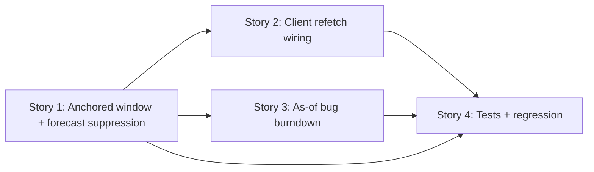

# User Stories — Previous Sprint Full Rolling Window

> Spec: ../spec.md
> Status: Complete

## Stories

| # | Story | Status | Priority | Tasks | Dependencies |
|---|---|---|---|---|---|
| 1 | [Server-side sprint-anchored rolling window + forecast suppression](story-1-server-anchored-window.md) | Completed ✅ | High | 7 | None |
| 2 | [Lift activeSprintId + wire sprintId refetch + loading state](story-2-client-refetch-wiring.md) | Completed ✅ | High | 7 | Story 1 |
| 3 | [Accurate as-of bug burndown](story-3-as-of-bug-burndown.md) | Completed ✅ | Medium | 7 | Story 1 |
| 4 | [Tests and regression coverage (current-sprint parity)](story-4-tests-and-regression.md) | Completed ✅ | Medium | 7 | Stories 1, 2, 3 |

**Progress:** 4 / 4 stories complete (28 / 28 tasks).

## Dependency Flow

- **Story 1** is the foundation: the server must honor a `sprintId`-anchored window before anything downstream is meaningful.
- **Story 2** makes the window observable end-to-end by refetching on tab change.
- **Story 3** corrects bug burndown accuracy for past windows; depends on Story 1's window/`endDate`.
- **Story 4** verifies all of the above and locks in current-sprint parity.

## Suggested Sequencing

1. Story 1 (backend window + suppression)
2. Story 3 (backend as-of burndown) — can proceed in parallel with Story 2
3. Story 2 (client refetch wiring)
4. Story 4 (tests + regression)
