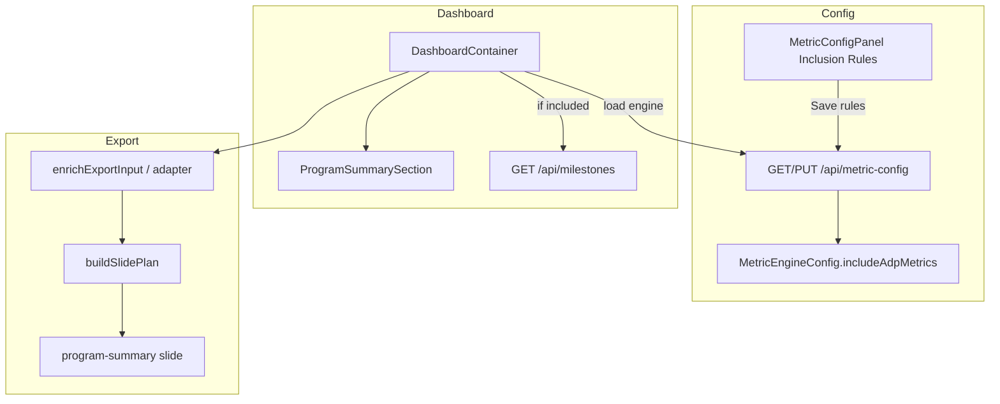

# Technical Spec: ADP Metrics Dashboard Toggle

> Parent: `.writ/specs/2026-06-29-adp-metrics-dashboard-toggle/spec.md`
> Stories: 1–4

## Architecture

## Data Model

See `sub-specs/database-schema.md`.

Field: `MetricEngineConfig.includeAdpMetrics` — `Boolean`, default `true`, program-wide.

## Module Responsibilities

| Module | Responsibility |
|---|---|
| `lib/metrics/types.ts` | Extend `MetricEngineConfigInput`; update `DEFAULT_ENGINE_CONFIG` |
| `lib/metrics/config-loader.ts` | Merge `includeAdpMetrics` with default `true` |
| `lib/metrics/adp-visibility.ts` (new, optional) | `isAdpMetricsIncluded()` helper |
| `app/api/metric-config/rules/route.ts` | Persist `includeAdpMetrics` with rules |
| `MetricConfigPanel.tsx` | Checkbox UI + save payload |
| `DashboardContainer.tsx` | Load flag; gate fetch/export |
| `ProgramSummarySection.tsx` | Conditionally render ADP stack |
| `lib/export/slide-plan.ts` | Skip milestone slide kinds |
| `lib/export/slides/program-summary.tsx` | Skip milestone tiles in `buildTiles` |
| `lib/export/adapter.ts` | Null milestone export fields when excluded |

## Dashboard Load Sequence

1. Mount `DashboardContainer`.
2. Parallel or sequential: fetch metrics (existing) + fetch metric config for `includeAdpMetrics`.
3. If included: run existing milestone fetch effects.
4. If excluded: set milestone state to idle/empty; never call `/api/milestones`.

Post-sync handler (`handleSync`) calls `fetchMilestones()` today — guard with `includeAdpMetrics`.

Scope refresh effect — same guard.

## Export Gating

Pass `includeAdpMetrics` into export pipeline via:

- Option A: add `includeAdpMetrics` to `ExportInput` / `SlidePlanBuildOptions`.
- Option B: pre-clear milestone fields in `handleExport` when excluded.

Recommended: Option A for explicit slide-plan tests.

When excluded:

- `buildSlidePlan`: skip `workstream-milestone` push loop entries; skip milestone appendix.
- `buildTiles`: do not append Monthly Milestone / Quarterly Progress tiles.
- `enrichExportInput`: `milestones: []`, `programRollup: null`, `milestoneContext: null`.

## Error & Rescue Map

| Operation | What Can Fail | Planned Handling | Test Strategy |
|---|---|---|---|
| Load metric config (dashboard) | GET 500 / network | Default to included; optional console warn only | Component test with failed config fetch |
| Load metric config (panel) | GET 500 | Existing panel error + Retry | Existing MetricConfigPanel tests |
| Save rules + includeAdpMetrics | Invalid body (non-boolean) | 422 `{ errors: [{ field: 'includeAdpMetrics', ... }] }` | API test |
| Save rules + includeAdpMetrics | DB transaction failure | 500 `{ error }`; DB unchanged | API mock test |
| Milestone fetch (when included) | API error | Existing milestonesError UI | Unchanged |
| Export (ADP excluded) | N/A — no milestone data needed | Export succeeds without ADP slides | Export unit test |

## Shadow Paths

| Flow | Happy Path | Nil Input | Empty Input | Upstream Error |
|---|---|---|---|---|
| Dashboard load (ADP on) | Panel + milestone fetch | No engine row → default on | N/A | Config fail → default on |
| Dashboard load (ADP off) | No fetch, panel hidden | No engine row → default on (shows ADP) | N/A | Config fail → default on |
| Save ADP off | Toast; DB updated | Missing boolean → 422 | N/A | 500 → toast error |
| Export (ADP off) | Deck without milestone content | No milestones in input | Empty milestones | Export still succeeds |
| Reload after save | New ADP state visible | — | — | — |

## Interaction Edge Cases

| Edge Case | Planned Handling |
|---|---|
| Save ADP off without reload | Session unchanged until reload (documented in helper text) |
| Toggle ADP while export in progress | Export uses flag value at click time |
| ADP off + Sync Now | Metrics refresh; milestones still skipped |
| ADP off + scope change | Metrics/milestones scope unchanged for milestones (skipped) |
| Double-click Save rules | Existing saving/debounce on button |

## Traceability

| Story | Modules |
|---|---|
| 1 | schema, types, loader, rules API |
| 2 | MetricConfigPanel |
| 3 | DashboardContainer, ProgramSummarySection, DashboardShell |
| 4 | export modules, integration tests |
