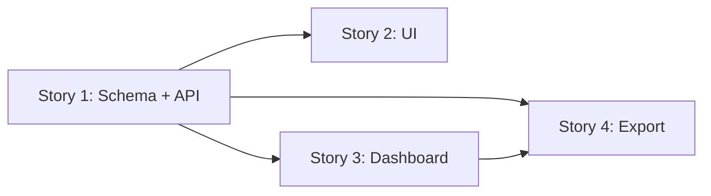

# User Stories: ADP Metrics Dashboard Toggle

> Spec: [spec.md](../spec.md)

## Summary

| Story | Title | Status | Tasks | Priority |
|---|---|---|---|---|
| 1 | [Config Schema and Rules API](./story-1-config-schema-and-api.md) | Not Started | 7 | High |
| 2 | [Inclusion Rules UI](./story-2-inclusion-rules-ui.md) | Not Started | 7 | High |
| 3 | [Dashboard Fetch and Panel Gating](./story-3-dashboard-gating.md) | Not Started | 7 | High |
| 4 | [Export Gating and Integration Tests](./story-4-export-gating.md) | Not Started | 7 | Normal |

**Total tasks:** 28  
**Progress:** 0 / 28 (0%)

## Dependencies

- **Story 1** is the foundation — schema, loader, and rules API.
- **Stories 2 and 3** can run in parallel after Story 1.
- **Story 4** depends on Story 3 for dashboard config load wiring used at export time.

## Suggested Implementation Order

1. Story 1 — Config Schema and Rules API
2. Story 2 + Story 3 (parallel)
3. Story 4 — Export Gating and Integration Tests

## Quick Links

- [Story 1: Config Schema and Rules API](./story-1-config-schema-and-api.md)
- [Story 2: Inclusion Rules UI](./story-2-inclusion-rules-ui.md)
- [Story 3: Dashboard Fetch and Panel Gating](./story-3-dashboard-gating.md)
- [Story 4: Export Gating and Integration Tests](./story-4-export-gating.md)
- [Technical Spec](../sub-specs/technical-spec.md)
- [API Spec](../sub-specs/api-spec.md)
- [Database Schema](../sub-specs/database-schema.md)
