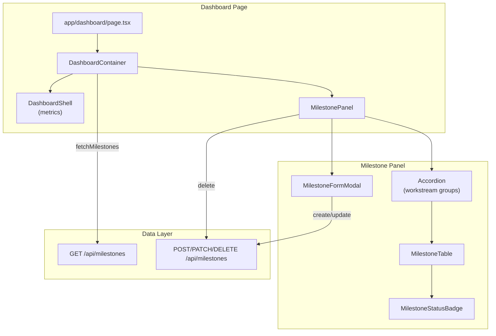

# Dashboard Milestone Panel

> **Status:** Implemented (Stories 2-3)
> **Depends on:** [Milestones API](milestones.md), [Dashboard Shell](dashboard-shell.md)

## Overview

The Dashboard Milestone Panel is a collapsible UI section on the `/dashboard` page that displays feature-level milestones grouped by workstream. It supports CRUD operations via the `/api/milestones` endpoints, renders loading/empty/error states independently from the metrics section above, and shows a derived progress summary from milestone status values.

## Architecture



## Components

| Component | Location | Responsibility |
|-----------|----------|----------------|
| `MilestonePanel` | `components/Dashboard/MilestonePanel.tsx` | Main panel container; groups milestones by workstream, renders loading/empty/error, delegates CRUD to API |
| `MilestoneProgressSummary` | `components/Dashboard/MilestoneProgressSummary.tsx` | Derived status summary (`NotStarted`, `InProgress`, `Done`) and completion percent (`done / total * 100`) |
| `MilestoneStatusBadge` | `components/Dashboard/MilestoneStatusBadge.tsx` | Mantine Badge with status color mapping (NotStarted=gray, InProgress=blue, Done=green) |
| `MilestoneFormModal` | `components/Dashboard/MilestoneFormModal.tsx` | Modal for create/edit; fields: title, workstream, target month, status, ADO Feature ID, notes |

## State Handling

| State | Trigger | UI |
|-------|---------|-----|
| **Loading** | `loading=true` | Skeleton placeholders with `aria-label="Loading milestones"` |
| **Error** | `error` string set | Red alert with message and Retry button |
| **Empty** | `milestones.length === 0` | Message: "No milestones yet. Add your first milestone to start tracking." |
| **Populated** | `milestones.length > 0` | Accordion with workstream groups; each group shows Mantine Table with milestones |

**Error isolation:** Milestone API failure does not affect the metrics section or workstream cards. `DashboardContainer` fetches metrics and milestones separately via `fetchMetrics` and `fetchMilestones`.

## Progress Summary Rules

- **Counts:** Derived from each milestone's `status` field:
  - `NotStarted`
  - `InProgress`
  - `Done`
- **Completion percent:** `Math.round((done / total) * 100)`
- **Zero safety:** when `total === 0`, completion is `0%`

## Grouping and Display

- **Grouping:** Milestones are grouped by `workstream.name` (fallback: "Unknown workstream")
- **Sorting:** Within each group, milestones are sorted by `targetMonth` ascending
- **Target month format:** `formatTargetMonth()` in `lib/milestones/format.ts` — displays as "MMM YYYY" (e.g. "Mar 2026")
- **Columns:** Title, Target Month, Status, ADO Feature ID, Notes, Actions (Edit/Delete when workstreams available)

## Status Badge Color Mapping

| Status | Badge Color |
|--------|-------------|
| NotStarted | gray |
| InProgress | blue |
| Done | green |

## CRUD Actions

| Action | Trigger | API Call | Panel Refresh |
|--------|---------|----------|---------------|
| Create | "Add Milestone" button → form submit | `POST /api/milestones` | `onRefresh()` |
| Update | Edit icon → form submit | `PATCH /api/milestones/[id]` | `onRefresh()` |
| Delete | Delete icon → confirm | `DELETE /api/milestones/[id]` | `onRefresh()` |

All CRUD handlers call `onRefresh()` after success to refetch milestones from `GET /api/milestones`.

## Integration

`DashboardContainer` fetches milestones independently from metrics:

```ts
useEffect(() => { fetchMilestones(); }, [fetchMilestones]);
```

Workstream options for the "Add Milestone" form are derived from `viewModel.workstreamCards` when metrics load successfully; otherwise from milestones' included `workstream` relation.

## Tests and Storybook

| Coverage | Location |
|----------|----------|
| Component tests | `__tests__/components/Dashboard/MilestonePanel.test.tsx` — populated, empty, loading, error, status badges, progress summary, workstream fallback |
| Progress summary tests | `__tests__/components/Dashboard/MilestoneProgressSummary.test.tsx` — mixed status, empty list, all-done states |
| API edge-case tests | `__tests__/app/api/milestones/route.test.ts`, `__tests__/app/api/milestones/[id]/route.test.ts` — invalid status, missing required fields, malformed `targetMonth`, non-existent `workstreamId` |
| Integration tests | `__tests__/components/Dashboard/DashboardIntegration.test.tsx` — "renders milestone panel with mocked API when milestones exist" |
| Storybook | `components/Dashboard/MilestonePanel.story.tsx` — `PopulatedMixedStatus`, `PopulatedAllDone`, `Empty`, `Loading`, `Error` |

## Related Files

| File | Purpose |
|------|---------|
| `components/Dashboard/MilestonePanel.tsx` | Main panel component |
| `components/Dashboard/MilestoneProgressSummary.tsx` | Progress counts and completion percent |
| `components/Dashboard/MilestoneStatusBadge.tsx` | Status badge with color mapping |
| `components/Dashboard/MilestoneFormModal.tsx` | Create/edit modal |
| `components/Dashboard/DashboardContainer.tsx` | Fetch lifecycle and integration |
| `lib/milestones/format.ts` | `formatTargetMonth()` |
| `lib/milestones/types.ts` | `ApiMilestone` type |
