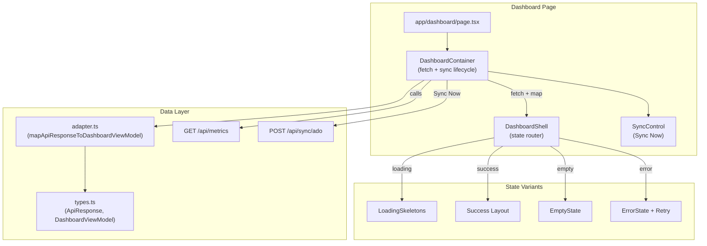
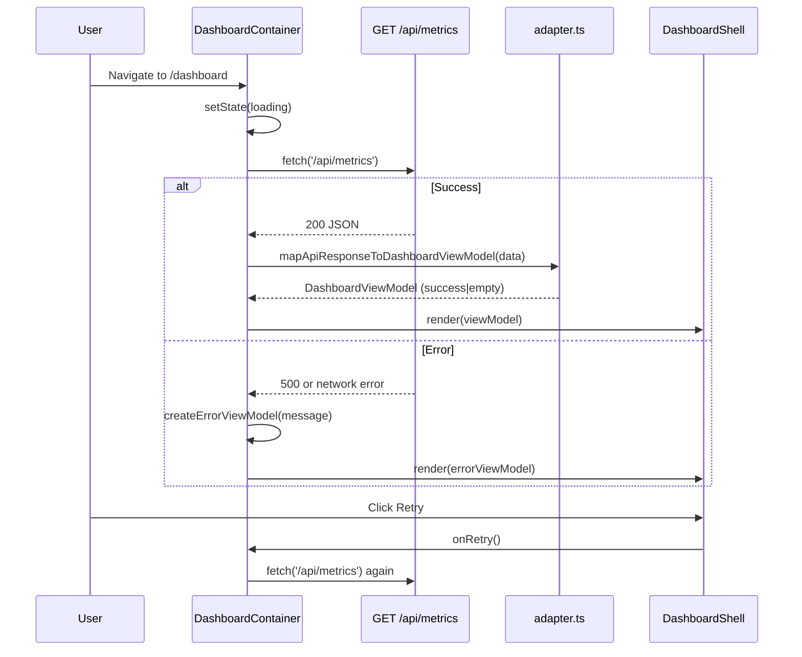
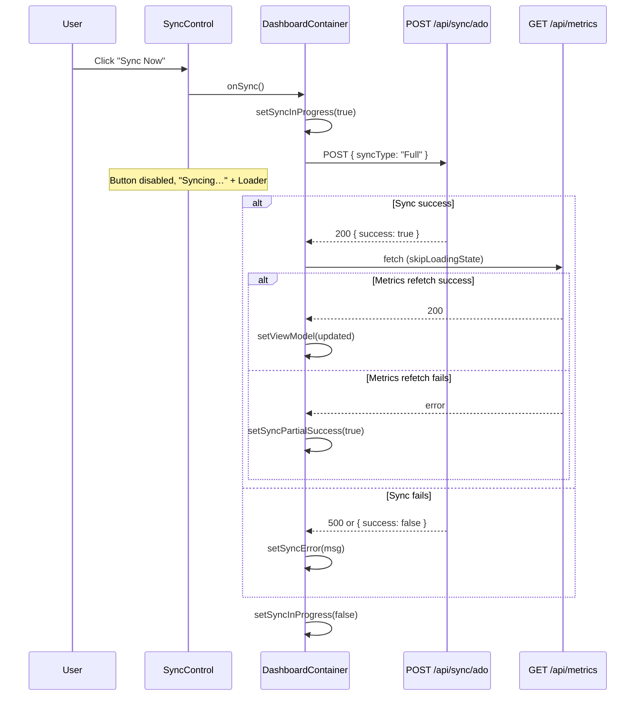

# Dashboard Shell

> **Status:** Implemented (Story 1, Story 5)
> **Depends on:** Metric Engine API (`GET /api/metrics`), Sync API (`POST /api/sync/ado`)

## Overview

The Dashboard Shell provides the foundational data contract, fetch lifecycle, and state management for the Program Dashboard UI. It maps the backend metric API response into UI-friendly view models and renders loading, success, empty, and error states. **Story 5** adds a sync trigger ("Sync Now") in the header region that triggers a full ADO sync and auto-refreshes metrics on completion, with in-flight feedback and non-blocking error/partial-success messaging.

## Architecture



## Components

| Component | Location | Responsibility |
|-----------|----------|----------------|
| `DashboardPage` | `app/dashboard/page.tsx` | Next.js page route, wraps container in Mantine `Container` |
| `DashboardContainer` | `components/Dashboard/DashboardContainer.tsx` | Client component managing fetch lifecycle and sync trigger; retry logic; wires SyncControl |
| `DashboardShell` | `components/Dashboard/DashboardShell.tsx` | Routes view model state to loading, success, empty, or error UI |
| `SyncControl` | `components/Dashboard/SyncControl.tsx` | "Sync Now" button with in-flight feedback; non-blocking error and partial-success alerts |
| `ProgramSummarySection` | `components/Dashboard/ProgramSummarySection.tsx` | Renders program metrics as card tiles with RAG indicators |
| `RagBadge` | `components/Dashboard/RagBadge.tsx` | RAG status badge (Green/Amber/Red) — used by metric tiles |
| `WorkstreamCardsGrid` | (inline in DashboardShell) | Placeholder for Story 3 — renders workstream health cards |
| `MilestonePanel` | `components/Dashboard/MilestonePanel.tsx` | Below shell; milestones grouped by workstream — see [Dashboard Milestone Panel](dashboard-milestone-panel.md) |

## Data Flow



### Sync Trigger Flow (Story 5)



## State Model

### Metrics View States

| State | Trigger | UI |
|-------|---------|-----|
| `loading` | Initial render or retry | Skeleton placeholders for summary tiles and workstream cards |
| `success` | API returns data with sprint and workstreams | Program summary section + workstream cards grid |
| `empty` | API returns null sprint, empty workstreams, null program | Informational message: "No metrics data available" |
| `error` | API returns non-200 or fetch throws | Error alert with message and Retry button |

### Sync Control States (Story 5)

| State | Trigger | UI |
|-------|---------|-----|
| **Idle** | Default; sync not running | "Sync Now" button enabled with refresh icon |
| **In-flight** | User clicked Sync Now; `POST /api/sync/ado` pending | Button disabled, "Syncing…" label, Loader icon, `aria-busy="true"` |
| **Failure** | Sync API returns error or `success: false` | Red alert "Sync failed" with message; Dismiss button; Sync Now remains available for retry |
| **Partial success** | Sync succeeded but metrics refetch failed | Yellow alert "Partial success" — "Sync completed but metrics refresh failed. Use Sync Now to retry."; layout preserved |

## View Model Types

The adapter produces a `DashboardViewModel` that decouples presentational components from the API response shape:

```typescript
interface DashboardViewModel {
  state: 'loading' | 'success' | 'empty' | 'error';
  sprintLabel: string | null;
  computedAtLabel: string | null;
  programMetrics: MetricTileViewModel[] | null;
  workstreamCards: WorkstreamCardViewModel[];
  errorMessage?: string;
}
```

Each metric is mapped to a `MetricTileViewModel` with formatted display values and null-safe "N/A" placeholders.

## Null Handling

- All metric values can be null from the API
- The adapter formats null values as `"N/A"` strings
- RAG values are safely cast: only `'Green'`, `'Amber'`, `'Red'` are accepted; anything else becomes `null`
- Detail values (plannedPoints, completedPoints, etc.) use `"N/A"` for null

## Related Files

| File | Purpose |
|------|---------|
| `lib/dashboard/types.ts` | API response types and UI view model types |
| `lib/dashboard/adapter.ts` | Data adapter — maps API response to view models |
| `components/Dashboard/DashboardShell.tsx` | Shell component with state routing |
| `components/Dashboard/ProgramSummarySection.tsx` | Program summary section with metric tiles (Story 2) |
| `components/Dashboard/RagBadge.tsx` | RAG indicator badge for metric tiles |
| `components/Dashboard/DashboardContainer.tsx` | Fetch lifecycle and sync trigger container |
| `components/Dashboard/SyncControl.tsx` | Sync Now button and sync state alerts |
| `app/dashboard/page.tsx` | Dashboard page route |
| `__tests__/lib/dashboard/adapter.test.ts` | Adapter unit tests (12 tests) |
| `__tests__/components/Dashboard/DashboardShell.test.tsx` | Shell component tests (6 tests) |
| `__tests__/components/Dashboard/DashboardContainer.test.tsx` | Container integration tests (5 tests) |
| `__tests__/components/Dashboard/DashboardIntegration.test.tsx` | Sync Now flow, in-flight locking, success auto-refresh, failure paths (Story 5) |
| `__tests__/components/Dashboard/SyncControl.test.tsx` | SyncControl unit tests (idle, in-flight, error, partial-success) |
| `components/Dashboard/MilestonePanel.tsx` | Milestone panel below shell — see [Dashboard Milestone Panel](dashboard-milestone-panel) |
