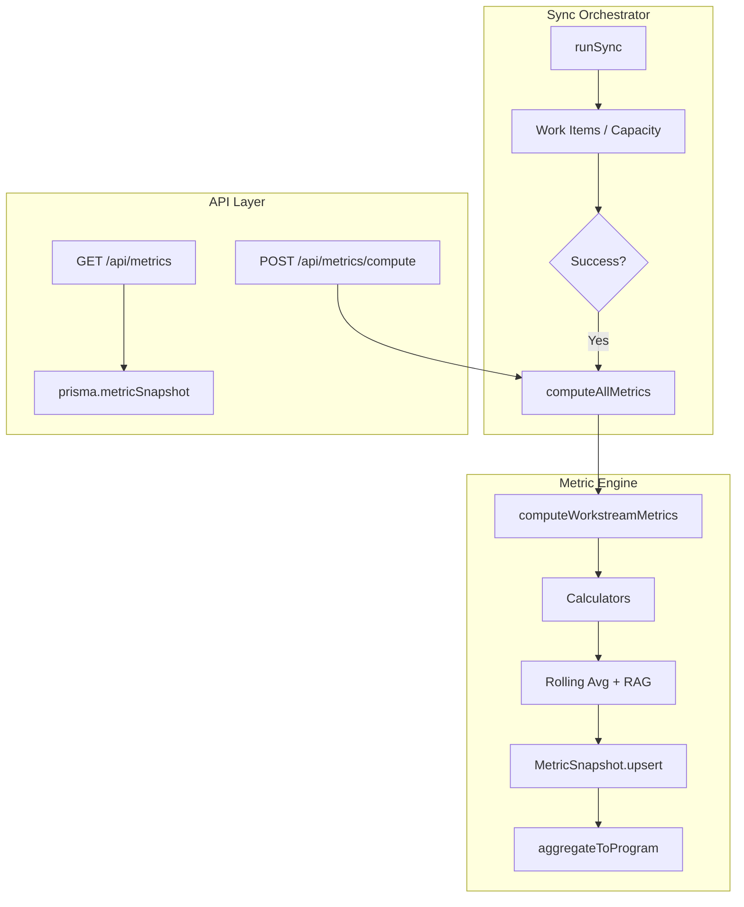
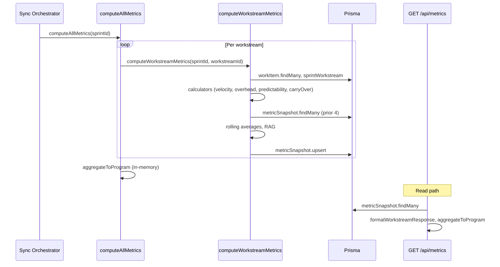

# Metric Engine

Metrics are computed after sync, persisted to `MetricSnapshot`, and exposed via API routes. The dashboard shows fresh health data without manual steps.

## Overview

- **Orchestration**: `computeAllMetrics()` iterates workstreams, calls `computeWorkstreamMetrics()` per workstream (with isolation), then aggregates to program level.
- **Persistence**: Per-workstream snapshots are upserted to `MetricSnapshot` (compound unique `sprintId` + `workstreamId`).
- **API**: `GET /api/metrics` returns fetched snapshots; `POST /api/metrics/compute` triggers computation.
- **Sync hook**: After successful sync, the orchestrator calls `computeAllMetrics(currentSprintId)` (non-fatal on failure).

## Architecture



## Data Flow



## Components

| Component | Purpose | Location |
|-----------|---------|----------|
| `computeWorkstreamMetrics` | Per-workstream computation: query data → calculators → rolling avg → RAG → upsert | `lib/metrics/snapshot.ts` |
| `computeAllMetrics` | Orchestrate all workstreams; error isolation per workstream | `lib/metrics/orchestrator.ts` |
| `aggregateToProgram` | Weighted program aggregate from snapshots | `lib/metrics/aggregator.ts` |
| GET /api/metrics | Fetch snapshots, format response, optional program | `app/api/metrics/route.ts` |
| POST /api/metrics/compute | Trigger computation | `app/api/metrics/compute/route.ts` |
| Sync hook | Call `computeAllMetrics` after sync success | `lib/sync/orchestrator.ts` |

## State Management

- **MetricSnapshot**: Persisted per sprint per workstream. Upsert is idempotent.
- **Program aggregate**: Computed on-the-fly from snapshots; not stored.
- **Error isolation**: Failures in one workstream do not abort others; metric computation errors do not fail the sync.

## Usage Examples

**Fetch metrics (default: latest sprint with snapshots):**

```bash
curl "http://localhost:3000/api/metrics"
```

**Fetch for specific sprint:**

```bash
curl "http://localhost:3000/api/metrics?sprintId=clx..."
```

**Trigger computation:**

```bash
curl -X POST "http://localhost:3000/api/metrics/compute" \
  -H "Content-Type: application/json" \
  -d '{"sprintId":"clx..."}'
```

## Related Files

- `lib/metrics/snapshot.ts` — Per-workstream compute
- `lib/metrics/orchestrator.ts` — Orchestrator
- `lib/metrics/aggregator.ts` — Program aggregate
- `app/api/metrics/route.ts` — GET handler
- `app/api/metrics/compute/route.ts` — POST handler
- `lib/sync/orchestrator.ts` — Sync hook (metrics after success)
